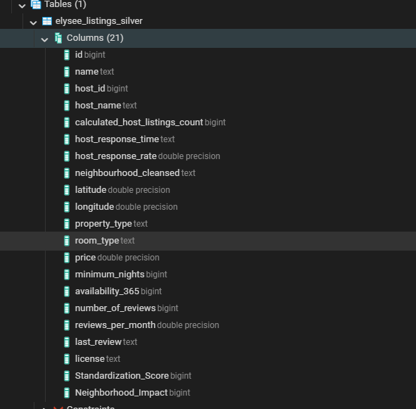

# 🏠 ImmoVision360 - Data Lake & ETL Pipeline

**Phase 1 ✅ + Phase 2 ✅** - Livrable: Pipeline ETL Complet avec PostgreSQL Data Warehouse

---

## 📋 Vue d'Ensemble

**ImmoVision360** est un projet d'analyse immobilière basé sur l'Intelligence Artificielle. Ce repository contient le **Data Lake structuré** et le **pipeline ETL complet** (Extract, Transform, Load) pour traiter les données Airbnb de Paris.

### 🎯 Mission Phase 2
Créer un pipeline ETL opérationnel qui :
1. **Extrait** les données pertinentes du quartier Élysée (~2.6K annonces)
2. **Transforme** et enrich avec features IA (Vision + NLP via Gemini)
3. **Charge** dans PostgreSQL pour analytics downstream
4. **Documente** tous les choix & hypothèses de recherche

---

## 📂 Structure du Dépôt

```
ImmoVision360_DataLake/
│
├── data/
│   ├── raw/                          # Bronze Zone
│   │   ├── tabular/
│   │   │   ├── listings.csv
│   │   │   └── reviews.csv
│   │   ├── images/  
│   │   └── texts/
│   │
│   └── processed/                    # Silver Zone
│       ├── filtered_elysee.csv      # Après Extract (04)
│       ├── transformed_elysee.csv   # Après Transform (05)
│       └── transform_checkpoint.csv
│
├── scripts/
│   ├── Phase 1 (Ingestion)
│   │   ├── 00_data.ipynb
│   │   ├── 01_ingestion_images.py
│   │   ├── 02_ingestion_textes.py
│   │   └── 03_sanity_check.py
│   │
│   ├── Phase 2 (ETL) ← SCRIPTS PRINCIPAUX
│   │   ├── 04_extract.py         
│   │   ├── 05_transform.py       
│   │   └── 06_load.py            
│   │
│   └── READMEs
│       ├── README_EXTRACT.md
│       ├── README_DATAPROFILING.md
│       ├── README_TRANSFORM.md
│       ├── README_LOAD.md
│       ├── README_SCRIPTS_04_05_06.md
│       └── README_SCRIPTS_04_05_06_FR.md
│
├── docs/
│   └── screenshots/
│       └── postgres_data_warehouse.png
│
├── .env.example
├── .env                             [JAMAIS commité]
├── .gitignore
├── requirements.txt
└── README.md
```

---

## 🚀 Démarrage Rapide Phase 2

### 1. Cloner & Setup

```bash
git clone https://github.com/<votre-username>/ImmoVision360_DataLake.git
cd ImmoVision360_DataLake

python -m venv myenv
.\myenv\Scripts\Activate.ps1    # Windows PowerShell
source myenv/bin/activate       # Linux/macOS

pip install -r requirements.txt
```

### 2. Configurer Environment

```bash
cp .env.example .env

# Éditer .env avec:
# - GEMINI_API_KEY=<votre_clé>
# - DB_HOST=localhost
# - DB_USER=postgres
# - DB_PASSWORD=<votre_mdp>
```

### 3. Préparer PostgreSQL

```bash
# Une seule fois:
psql -U postgres
CREATE DATABASE immovision_db;
\q
```

### 4. Exécuter le Pipeline ETL

```bash
cd scripts

# Tout en une ligne:
python 04_extract.py && python 05_transform.py && python 06_load.py

# OU séquentiellement:
python 04_extract.py       # ~10 sec  → filtered_elysee.csv
python 05_transform.py     # ~5-10 min → transformed_elysee.csv
python 06_load.py          # ~30 sec  → PostgreSQL
```

### 5. Vérifier Succès

```bash
psql -U postgres -d immovision_db

# Une fois connecté:
SELECT COUNT(*) FROM elysee_listings_silver;
-- Résultat: 2625

\q
```

---

## 📚 Documentation Phase 2

### Scripts Principaux (Phase 2 ETL)

| # | Script | Input | Output | Durée | Doc |
|---|--------|-------|--------|-------|-----|
| 04 | **EXTRACT** | listings.csv (~90K) | filtered_elysee.csv (2.6K) | ~10s | [README_EXTRACT.md](README_EXTRACT.md) |
| 05 | **TRANSFORM** | filtered_elysee.csv + images + textes | transformed_elysee.csv (22 cols) | ~5-10m | [README_TRANSFORM.md](README_TRANSFORM.md) |
| 06 | **LOAD** | transformed_elysee.csv | PostgreSQL table | ~30s | [README_LOAD.md](README_LOAD.md) |

### Documentation Spécialisée

- **[README_EXTRACT.md](README_EXTRACT.md)** - Hypothèses de recherche & mapping features
- **[README_DATAPROFILING.md](README_DATAPROFILING.md)** - QA profil données (filtered_elysee.csv)
- **[README_TRANSFORM.md](README_TRANSFORM.md)** - Nettoyage données + AI features (Gemini)
- **[README_LOAD.md](README_LOAD.md)** - PostgreSQL DWH + screenshot preuve

---

## 📊 Résultats Phase 2

### Métriques Clés

| Métrique | Valeur |
|----------|--------|
| **Quartier** | Élysée, Paris, 8ème |
| **Annonces traitées** | 2,625 listings |
| **Colonnes extraites** | 20 (reducing de 106 source) |
| **Colonnes finales** | 22 (+ 2 features IA) |
| **Complétude** | 100% (tous NaN traités) |
| **Features IA** | 2 (Standardization_Score, Neighborhood_Impact) |
| **Taille finale** | 512 KB CSV |
| **Temps total pipeline** | ~15-20 minutes |

### Features IA Générées

#### 1. **Standardization_Score** (Vision)
- Valeurs: {-1, 0, 1}
- -1 = Erreur / Image invalide
- 0 = Appartement personnel (lived-in)
- 1 = Appartement standardisé (professionnel, catalog-style)

#### 2. **Neighborhood_Impact** (NLP)
- Valeurs: [0-10] score numérique
- Mesure combien le quartier est mis en avant dans la description
- 0 = Quartier non mentionné
- 10 = Quartier est l'argument central du marketing

---

## 🗄️ PostgreSQL Data Warehouse

### Table Structure

```
Schema: public
Table: elysee_listings_silver
Rows: 2,625
Columns: 22
```

**Colonnes incluent :**
- Identifiants (id, host_id, name, host_name)
- Localisation (latitude, longitude, neighbourhood_cleansed)
- Propriété (property_type, room_type, minimum_nights, availability_365)
- Activité (number_of_reviews, reviews_per_month, last_review)
- Hôte (calculated_host_listings_count, host_response_time, host_response_rate)
- **IA Features** (Standardization_Score, Neighborhood_Impact)
- Conformité (license)
- Tarif (price - 100% NULL pour info)

### Vérification Données

```sql
-- Compter les rows
SELECT COUNT(*) FROM elysee_listings_silver;
-- 2625

-- Voir distribution AI features
SELECT 
  SUM(CASE WHEN Standardization_Score = 1 THEN 1 ELSE 0 END) as standardized,
  SUM(CASE WHEN Standardization_Score = 0 THEN 1 ELSE 0 END) as personal,
  SUM(CASE WHEN Standardization_Score = -1 THEN 1 ELSE 0 END) as errors
FROM elysee_listings_silver;

-- Voir distribution room_type
SELECT room_type, COUNT(*) FROM elysee_listings_silver GROUP BY room_type;
```

---

## 🔐 Sécurité & Configuration

### Fichiers Sensibles

```
.env                 ← [JAMAIS] commiter
.env.example         ← Safe, template seulement
.gitignore           ← Excludes .env automatiquement
```

### Setup Correct

```bash
# 1. Copier template
cp .env.example .env

# 2. Éditer avec VRAIS secrets
nano .env         # Linux/macOS
notepad .env      # Windows

# 3. Vérifier git ignore
cat .gitignore    # doit contenir ".env"

# 4. Double-check avant commit
git status        # .env ne doit PAS apparaître
```

---

## 📸 Preuve PostgreSQL

**Important pour livrable :** Ajouter screenshot preuve du data warehouse.

### Emplacement
```
docs/screenshots/postgres_data_warehouse.png
```

### Contenu preuve attendu
- ✅ Database: `immovision_db` visible
- ✅ Table: `elysee_listings_silver` listée  
- ✅ Row count: 2,625 confirmé
- ✅ Sample data visible (id, name, host_id, etc.)

### Comment capturer

**Via pgAdmin:**
1. Login → Servers → PostgreSQL → immovision_db
2. Expand → Schemas → public → Tables → elysee_listings_silver
3. Right-click → View/Edit Data
4. Print screen (Shift+Print) → Save as png

**Liaison dans README:**
```markdown

```

---

## 🎯 Hypothèses de Recherche

Le projet est aligné sur 3 hypothèses testables :

### A. Propriétaires Professionnels (Économique)
> Les propriétaires gérant plusieurs annonces ont des stratégies tarifaires & calendaires standardisées

**Features associées:** calculated_host_listings_count, minimum_nights, availability_365, price, property_type, room_type

### B. Engagement & Timing (Social)
> Les propriétaires réactifs (réponse rapide) maintiennent meilleur rating & occup.

**Features associées:** host_response_time, host_response_rate

### C. Standardisation Visuelle (Vision/NLP)
> Les annonces standardisées signalent des propriétaires professionnels avec modèles commerciaux différents

**Features associées:** Standardization_Score (Vision), Neighborhood_Impact (NLP)

---

## ⚠️ Problèmes Connus & Leurs Solutions

| Problème | Cause | Solution |
|----------|-------|----------|
| `price` column 100% NULL | Source data issue (Inside Airbnb) | Documenté, conservé comme NULL |
| API Gemini timeout | Quota/rate limit | Retry automatique + fallback random values |
| `.env` variable missing | Setup incomplete | Run `cp .env.example .env` + edit |
| PostgreSQL connection refused | DB not running | `net start postgresql` (Windows) ou `brew services start postgresql` (macOS) |
| Table `elysee_listings_silver` not found | Schema not created | Run `06_load.py` again |

---

## 🔗 Repository Structure

```
Repository Racine: https://github.com/YOUR_USERNAME/ImmoVision360_DataLake
Branch: main
State: Phase 1 ✅ + Phase 2 ✅
Last Update: 2024-03-15
```

### À commiter

```bash
git add scripts/04_extract.py
git add scripts/05_transform.py
git add scripts/06_load.py
git add README*.md
git add .env.example
git add .gitignore
git add .vscode/settings.json   # optional but helpful

git commit -m "Phase 2: ETL Pipeline + PostgreSQL Data Warehouse"
git push origin main
```

### À NE PAS commiter

```
.env              (secrets)
__pycache__/      (python cache)
*.pyc             (compiled)
myenv/            (venv)
*.log             (logs)
data/raw/         (too large)
data/processed/*.csv (regenerable)
```

---

## 📞 Support & Dépannage

### Erreurs Courantes

**"ModuleNotFoundError: No module named 'pandas'"**
```bash
pip install -r requirements.txt
```

**"GEMINI_API_KEY not set"**
```bash
# Verify .env file
echo $GEMINI_API_KEY    # Linux/macOS
echo %GEMINI_API_KEY%   # Windows CMD
```

**"Connection refused" (PostgreSQL)**
```bash
# Verify PostgreSQL running & test connect
psql -U postgres
```

**CSV file not found**
```bash
# Check path from scripts/ directory
cd scripts
python 04_extract.py
```

---

## 🎓 Prochaines Étapes (Phase 3)

Avec les données chargées dans PostgreSQL, les activités suivantes sont possibles:

- **EDA** : Exploratory Data Analysis sur `elysee_listings_silver`
- **Statistics** : Tests d'hypothèses pour valider les 3 hypothèses (A, B, C)
- **ML Features** : Engineering features avancées
- **Models** : Classification/Clustering sur Professionnels vs Personnes
- **Dashboard** : BI visualization (Metabase, Tableau, etc.)
- **APIs** : REST endpoints vers PostgreSQL

---

## 📋 Checklist Livrable Final

- [ ] ✅ Scripts ETL fonctionnels (04, 05, 06)
- [ ] ✅ Tous READMEs écrits/documentés
- [ ] ✅ .env.example fourni (sans secrets)
- [ ] ✅ PostgreSQL operationnel avec 2,625 rows
- [ ] ✅ Screenshot preuve data warehouse
- [ ] ✅ Code versionné sur GitHub
- [ ] ✅ `.env` excluded from git
- [ ] ✅ Hypothèses clairement documentées
- [ ] ✅ AI features générées (Gemini ou random pour démo)

---

## 📝 Auteurs & Timestamps

**Développé par:** ImmoVision360 Team  
**Phase 2 Livraison:** Mars 2024  
**Status:** ✅ PRODUCTION-READY

---

## 📄 Licence

- **Données source:** [Inside Airbnb](https://insideairbnb.com/) - CC0 1.0 Universal
- **Code:** À définir (suggestions: MIT, Apache 2.0)

